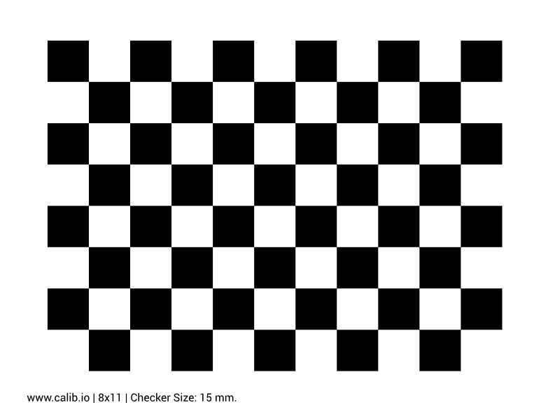

## 单目相机标定

运行环境：Ubuntu 22.04 + ROS2 humble

### 1、安装ROS相机标定包
```
sudo apt install ros-${ROS_DISTRO}-camera-calibration
```

### 2、运行相机驱动，发布相机话题
以海康相机为例：
```
ros2 launch hik_camera hik_camera.launch.py
```
相机发布话题名称：`/image_raw`

### 3、下载标定板
`https://calib.io/zh/pages/camera-calibration-pattern-generator`



### 4、运行标定程序
```
ros2 run camera_calibration cameracalibrator --size 7x10 --square 0.015 --ros-args -r image:=/image_raw
```
注意：`--size`参数为棋盘格的小方格交点，`--square`参数为标定板每个方块的边长
如果你的棋盘格是 8x11 的（即棋盘格上有 7 行和 10 列的小方格交点），则 --size 参数应设置为 7x10。


```
x：表示标定板在视野中的左右位置。
y：表示标定板在视野中的上下位置。
size：标定板在占视野的尺寸大小，也可以理解为标定板离摄像头的远近。
skew：标定板在视野中的倾斜位置。
```