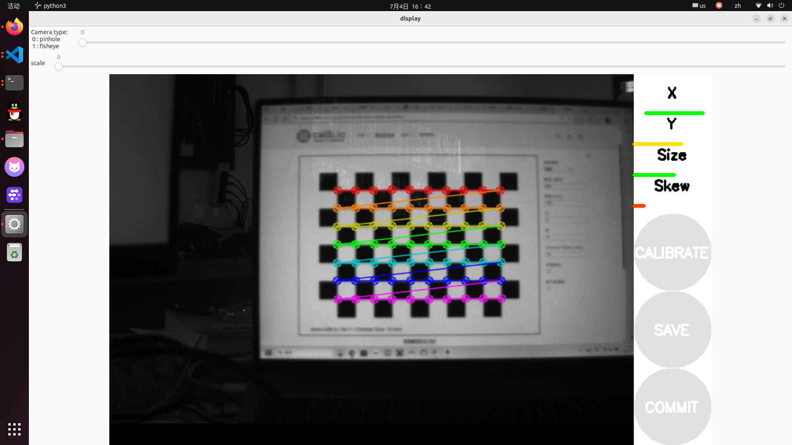

## 单目相机标定

运行环境：Ubuntu 22.04 + ROS2 humble

### 1、安装ROS相机标定包
```
sudo apt install ros-${ROS_DISTRO}-camera-calibration
```

### 2、运行相机驱动，发布相机话题
以海康相机为例：
```
ros2 launch hik_camera hik_camera.launch.py
```
相机发布话题名称：`/image_raw`

### 3、下载标定板
`https://calib.io/zh/pages/camera-calibration-pattern-generator`


### 运行标定程序
```
ros2 run camera_calibration cameracalibrator --size 8x11 --square 0.015 --ros-args -r image:=/image_raw
```


